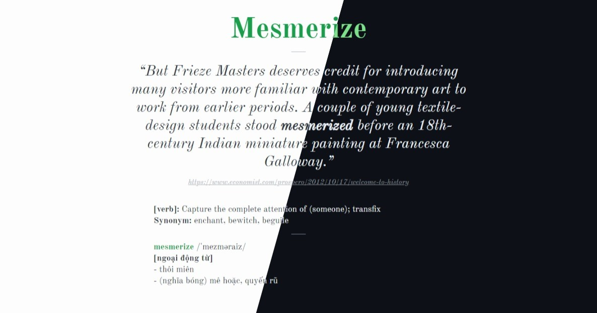

# Vivoca Daily

Google Chrome extension that shows you a new definition every time you open a new tab.

:tada: to [ezekg](https://github.com/ezekg/chrome-new-tab-vocab) for the original `</>`.

## Installation

1. Clone this repo
1. Navigate to chrome://extensions/ in Google Chrome
1. Enable "Developer Mode"
1. Click "Load Unpacked Extension..." and select the cloned repo folder
1. Done! :tada: :balloon: :confetti_ball: :tada: :balloon: :confetti_ball:
